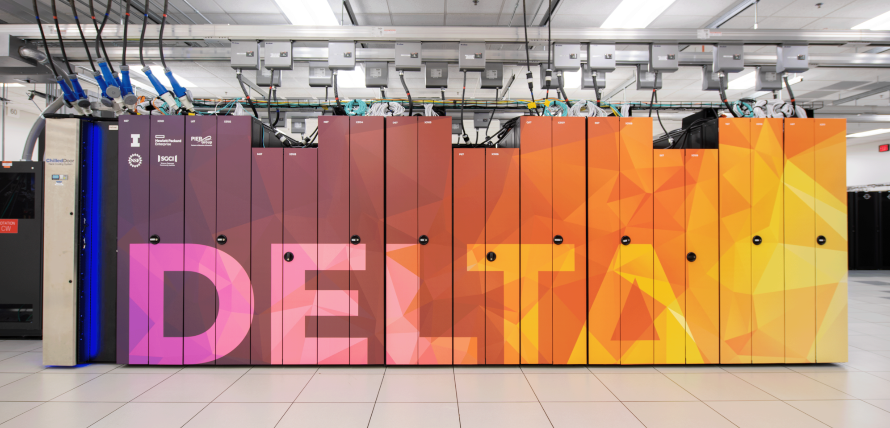
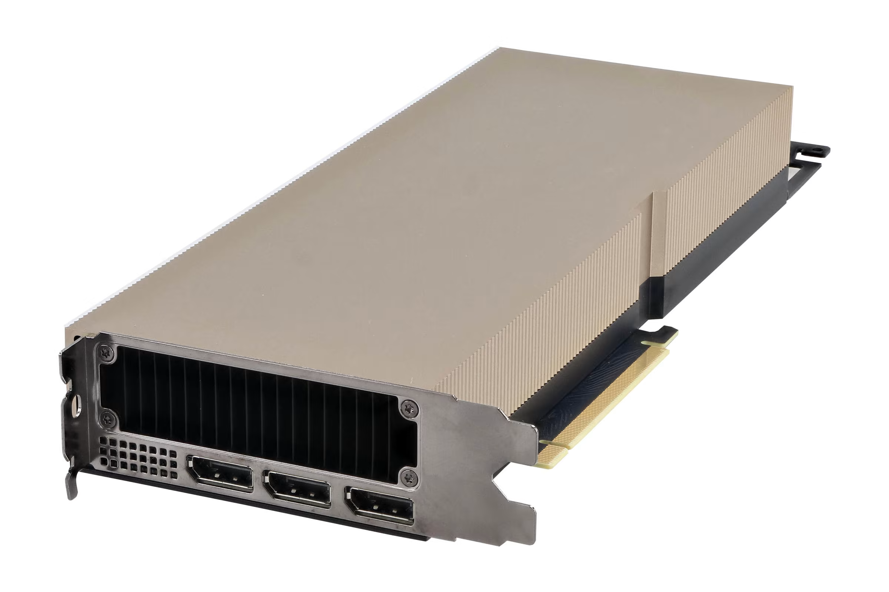

import {FileTree} from 'nextra/components'

# Visualizing Compute

The first step to understanding infra is to visualize it - so much of what we do is **virtualized**, or **abstracted** away that we tend to forget
our code is still running on a rack somewhere. Pictured above is Delta, the high-performance computer (HPC) cluster that we use to run large batch jobs, 
mainly for model experiments, training, and pipelining. Below it is a single A40 GPU, retailing for about $30,000 USD.

The case around the server racks is actually a form of abstraction in it of itself; you might be surprised to learn that Delta contains nearly *100 four-way
A40s (400 total)*. Reminding ourselves that as developers we are bound to physical hardware, even if it is virtualized, is necessary to contain our desire to
merely "hack" away at things rather than write and design scalable systems. 

In layman's terms, it's significantly easier to imagine ourselves as data center technicians when working with infra. We need to accurately describe our
networking, storage, and compute needs, most of the time without knowing exactly what the workload's resource consumption patterns will look like. If you
think of [running a job on Delta](/tutorials/run-a-delta-job) or [deploying a new service](/how-to/deploy-service) as physically setting up the hardware
yourself, adding it to the HPC cluster, then a lot of the abstraction will become more intuitive for you.

### Virtual Hierarchy
To help you visualize further, we will now traverse the layers of abstraction bottom-up for a service running on JetStream2 (JS2). It is more than
fine if some or all of these tools are new to you - typically, consumer hardware is packaged in one piece, and even if you have built a PC before,
all of it's components are colocated on a single motherboard.

<FileTree>
    <FileTree.Folder name="JS2 compute nodes" defaultOpen>
        <FileTree.Folder name="VM (OpenStack Magnum)" defaultOpen>
            <FileTree.Folder name="Kubernetes worker node" defaultOpen>
                <FileTree.Folder name="mobility-scooter-web-app" defaultOpen>
                    <FileTree.File name="api service" />
                    <FileTree.File name="web service" />
                    <FileTree.File name="worker service" />
                </FileTree.Folder>
                <FileTree.File name="databases, queues, etc" />
            </FileTree.Folder>
            <FileTree.Folder name="GPU VM (OpenStack Magnum)" defaultOpen>
                <FileTree.Folder name="Kubernetes worker node" defaultOpen>
                    <FileTree.Folder name="model-service" defaultOpen>
                        <FileTree.File name="yolo" />
                        <FileTree.File name="whisper" />
                    </FileTree.Folder>
                    </FileTree.Folder>
                </FileTree.Folder>
        </FileTree.Folder>
    </FileTree.Folder>
    <FileTree.Folder name="JS2 storage nodes" defaultOpen>
        <FileTree.Folder name="Containers (OpenStack Swift)" defaultOpen>
            <FileTree.File name="cluster logs" />
            <FileTree.File name="video uploads" />
            <FileTree.File name="terraform tfstate" />
        </FileTree.Folder>
        <FileTree.Folder name="Volumes (OpenStack Cinder)" defaultOpen>
            <FileTree.File name="VM boot + file system" />
            <FileTree.File name="model-service model weights" />
        </FileTree.Folder>
    </FileTree.Folder>
</FileTree>

Observant readers might notice something - storage and compute are separated categorically (compute vs. storage, standard vs. GPU nodes etc). This aligns with the hardware, e.g. Swift (object storage) does not
have the same access patterns that a VM's boot volume on Cinder. OpenStack Neutron (networking) is not depicted here, but you can imagine now why it might be a good idea to have an interface that enables hundreds
of compute and storage resources to be connected or exposed to the internet.  

### CI/CD
Continuous Integration and Continuous Development is perhaps the most abstract part of our infra, as it's designed for a simple developer experience (DX). Only two files are needed to integrate with our cluster:
a `deploy.yaml` file under `.github/workflows` and a `application.yaml` file under `deploy`. There are already a few tutorials here on how to get those configured, but the point here is highlight how even something
you can view and tinker with directly like a file on your computer contains a vast amount of abstraction. Often times the only way to truly understand an abstraction is to go to the source, which in this case are
the [helm charts](https://github.com/Mobility-Scooter-Project/mobility-scooter-infra/tree/main/charts) in the infra repo.

It also does not help that CI/CD is more fluid; some heavy images are built on the cluster, while most are built on ubuntu VMs via GitHub Actions. At the end of the day, push to deploy is an amazing feature for DX,
but a nightmare for cluster admins if something breaks. Generalized services provided by the cluster tend to be less abstract to use but more complicated to maintain in nature, as prioritizing DX is necessary when 
working with people with little previous experience with bare metal infra.